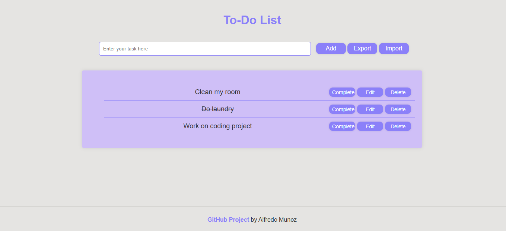

## Overview
To-Do List Single Page Application(SPA) built with vanila Javascript and CSS that allows users to add tasks, mark them as completed, edit, and delete them as well as import and export list of tasks.




## Features
- **Add Tasks**: Enter a task in the input field and click "Add" to create a new to-do item.
- **Edit Tasks**: Click "Edit" to modify the content of a task.
- **Mark as Completed**: Click "Complete" to mark the task as completed.
- **Delete Tasks**: Click "Delete" to remove a task from the list.
- **Import/Export Tasks**: Import and export tasks list as csv file.
- **Responsive Design**: The layout adjusts to fit different screen sizes.

## Try It
https://todo-list-app-7.netlify.app/

## Getting Started
### Clone the Repository
```bash
git clone https://github.com/Alfredomg7/TodoSPA.git
```
### Navigate to the Project Directory
```bash
cd TodoSPA
```
### Run Application
#### Using a Local HTTP Server:
To run the application, you need to serve it using a local HTTP server. You can use Python's built-in HTTP server as shown below:
#### Using Python3:
```bash
python -m http.server 8000
```
Then, open your web browser and navigate to `http://localhost:8000`.

## Project Structure
- `index.html`: The main HTML file containing the structure of the application.
- `styles.css`: The CSS file for styling the application.
- `main.js`: The main JavaScript file that initializes the application and handles imports.
- `todoList.js`: The JavaScript module managing the to-do list logic.
- `dom.js`: The JavaScript module for handling DOM manipulation tasks.
- `storage.js`: The JavaScript module for managing local storage operations.

## Contributing
Feel free to fork this repository and submit pull requests for any improvements or bug fixes.
